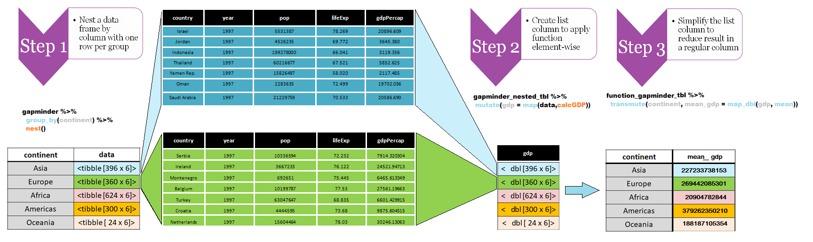

```{r setup, include=FALSE}
knitr::opts_chunk$set(echo = TRUE)
```


```{r, include=FALSE}
source("../bin/chunk-options.R")
knitr_fig_path("12-")
# Silently load in the data so the rest of the lesson works
gapminder <- utils::read.csv("data/gapminder_data.csv", header=TRUE)
knitr::kable(gapminder)
```

Previously we looked at how you can use functions to simplify your code.
We defined the `calcGDP` function, which takes the gapminder dataset,
and multiplies the population and GDP per capita column. We also defined
additional arguments so we could filter by `year` and `country`:

```{r}
# Takes a dataset and multiplies the population column
# with the GDP per capita column.
calcGDP <- function(dat, year=NULL, country=NULL) {
# Testing that the year is not NULL
  if(!is.null(year)) {
    dat <- dat[dat$year %in% year, ]
  }
# Testing that the country is not NULL
  if (!is.null(country)) {
    dat <- dat[dat$country %in% country,]
  }
  gdp <- dat$pop * dat$gdpPercap

  return(gdp)
}
```

A common task you'll encounter when working with data, is that you'll want to
run calculations on different groups within the data. In the above, we were
calculating the GDP by multiplying two columns together. But what if we wanted
to calculated the mean GDP per continent?

We could run `calcGDP` and then take the mean of each continent:

```{r}
library(tidyverse)

withGDP <- gapminder %>% 
  bind_cols(gdp = calcGDP(dat = gapminder))

mean(withGDP[withGDP$continent == "Africa", "gdp"])
mean(withGDP[withGDP$continent == "Americas", "gdp"])
mean(withGDP[withGDP$continent == "Asia", "gdp"])
```

But this isn't very *nice*. Yes, by using a function, you have reduced a
substantial amount of repetition. That **is** nice. But there is still
repetition. Repeating yourself will cost you time, both now and later, and
potentially introduce some nasty bugs.

We could write a new function that is flexible like `calcGDP`, but this
also takes a substantial amount of effort and testing to get right.

The abstract problem we're encountering is know as "group by/nest-map-unnest":

- Step 1 Make a list column based on `continent`
When we apply the function nest all the other columns are grouped by the 
variable we selected. The new column list by default will be named `data`.
It will contain the exact number of rows as if we would use to `filter` on 
that variable. 


continent | data
------------- | -------------
<chr>     |<list>
Asia      |<tibble [396 x 6]>
Europe    |<tibble [360 x 6]>
Africa    |<tibble [624 x 6]>
Americas  |<tibble [300 x 6]>
Oceania   |<tibble [ 24 x 6]>

```{r}
gapminder_nested_tbl <- gapminder %>% 
  group_by(continent) %>% 
  nest()

```

- Step 2 create a new column by using the function created above using `map`. 

```{r}
function_gapminder_tbl <- gapminder_nested_tbl %>%
  mutate(gdp = map(data,calcGDP))
```

- Step 3 simplify the list column into a new column regular column by using the
function `map_dbl`. We use `map_dbl` because we want to ensure that the result
is as expected a `doubble`. 

```{r}
function_gapminder_tbl %>%
  transmute(continent,mean_gdp = map_dbl(gdp, mean))

```





## The `purrr` package

For those of you who have used R before, you might be familiar with the
`apply` family of functions. While R's built in functions do work, we're
going to introduce you to another method for solving the "split-apply-combine"
problem. The [purrr](https://purrr.tidyverse.org/) package from the tidyverse
framework empowers the user by providing a consistent way that is ready to 
be piped for next stage. The concept of 
[functional programing](https://adv-r.hadley.nz/fp.html) is at heart a way 
to solve the problem by using a user friendly function.

We installed this package in an earlier challenge. Let us load it now:

```{r}
library("purrr")
```

As purrr is part of the tidyverse framework it also has a 
[cheatsheet](https://github.com/rstudio/cheatsheets/blob/master/purrr.pdf)

Think of purrr as solving the issue of how we apply a function to subset of 
data. 


```{r}


calcLifeExp <- function(dat, year=NULL, continent=NULL) {
# Testing that the year is not NULL
  if(!is.null(year)) {
    #subset dat with the variable year in a given year
    dat <- dat[dat$year %in% year, ]
  }
# Testing that the country is not NULL
  if (!is.null(continent)) {
    #subset dat with the variable continent in a given continent
    dat <- dat[dat$continent %in% continent,]
  }
  lifeExp <- dat$lifeExp

  return(lifeExp)
}

```

> ## Challenge 1
>
> Calculate the average life expectancy per continent. Which has the longest?
> Which had the shortest?
> > ## Solution to Challenge 1
> >
> > ```{r, eval = FALSE}
> > avgLfExpecPerCont <- gapminder %>% 
> >   group_by(continent) %>% 
> >   nest() %>%  
> >   mutate(lifeExp = map(data,calcLifeExp)) %>% 
> >   transmute(continent,meanLifeExp = map_dbl(lifeExp, mean)) %>% 
> >   ungroup() 
> >  
> > avgLfExpecPerCont %>% filter(meanLifeExp == max(meanLifeExp))
> >  
> >  
> > ```
> > Oceania has the longest and Africa the shortest.
> {: .solution}
{: .challenge}

What if we want a different type of output data structure?:

```{r}

 avgLfExpecPerCont <- gapminder %>% 
   group_by(continent) %>% 
   nest() %>%  
   mutate(lifeExp = map(data,calcLifeExp)) %>% 
   transmute(continent,meanLifeExp = map_chr(lifeExp, mean)) %>% 
   ungroup() 
avgLfExpecPerCont

```

We called the same function again, but changed the second letter to an `l`, so
the output was returned as a list.

```{r}
avgLfExpecPerCont <-
  gapminder %>% 
  group_by(continent) %>% 
  nest() %>%  
  mutate(lifeExp = map(data,calcLifeExp))  %>% 
  transmute(continent,meanLifeExp = as.integer(round(map_dbl(lifeExp, mean))))
avgLfExpecPerCont

```


We can specify multiple columns to group by:

``` {r}
avgLfExpecPerCont <-
  gapminder %>% 
  group_by(continent,year) %>% 
  nest() %>%  
  mutate(lifeExp = map(data,calcLifeExp))  %>% 
  transmute(continent,year,meanLifeExp = as.integer(round(map_dbl(lifeExp, mean))))
avgLfExpecPerCont


```

```{r}

solution <-
  gapminder %>% 
  group_by(continent,year) %>% 
  nest() %>%  
  mutate(lifeExp = map(data,calcLifeExp))  %>% 
  transmute(continent,year,meanLifeExp = map_dbl(lifeExp, mean))
solution

solution_2007 <- solution[solution$year == 2007, ]
solution_2007
```

Oceania had the longest average life expectancy in 2007 and Africa the lowest.

```{r, eval = FALSE}
solution_1952_2007 <- cbind(solution[solution$year == 1952, ], solution_2007)
difference_1952_2007 <- data.frame(continent = solution_1952_2007$continent...1,
                                   year_1957 = solution_1952_2007[[3]],
                                   year_2007 = solution_1952_2007[[6]],
                                   difference = solution_1952_2007[[6]] - solution_1952_2007[[3]])
difference_1952_2007

```


> ## Tip: printing numbers
>
> The `format` function can be used to make numeric
> values "pretty" for printing out in messages.
{: .callout}


> ## Challenge 2
>
> Calculate the average life expectancy per continent and year. Which had the
> longest and shortest in 2007? Which had the greatest change in between 1952
> and 2007?
> > ## Solution to Challenge 2
> >
> > ```{r, eval = FALSE}
> > solution <-
> >     gapminder %>% 
> >     group_by(continent,year) %>% 
> >     nest() %>%  
> >     mutate(lifeExp = map(data,calcLifeExp))  %>% 
> >     transmute(continent,year,meanLifeExp = map_dbl(lifeExp, mean))
> > solution
> > solution_2007 <- solution[solution$year == 2007, ]
> > solution_2007
> > ```
> >
> > Oceania had the longest average life expectancy in 2007 and Africa the lowest.
> >
> > ```{r, eval = FALSE}
> > solution_1952_2007 <- cbind(solution[solution$year == 1952, ], solution_2007)
> > difference_1952_2007 <- data.frame(continent = solution_1952_2007$continent...1,
> >                                    year_1957 = solution_1952_2007[[3]],
> >                                    year_2007 = solution_1952_2007[[6]],
> >                                    difference = solution_1952_2007[[6]] - solution_1952_2007[[3]])
> > difference_1952_2007
> > ```
> > Asia had the greatest difference, and Oceania the least.
> {: .solution}
{: .challenge}

